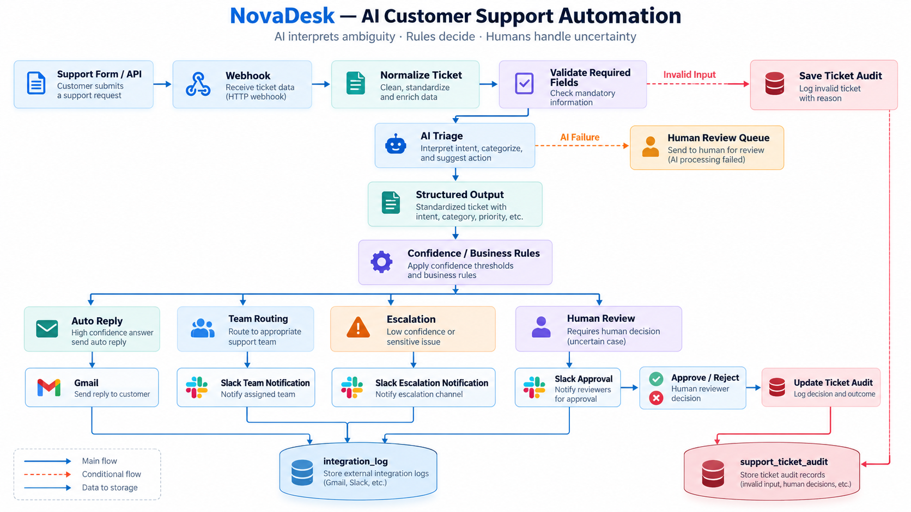

# NovaDesk — AI Customer Support Automation

NovaDesk is an n8n-based customer support automation project I built to handle support tickets from intake through routing, escalation, human review, auto-replies, and audit logging.

The main idea behind the project is simple:

> AI interprets ambiguity. Rules decide. Humans handle uncertainty.

Instead of letting the AI control the whole workflow, NovaDesk uses AI for classification and summarization, then relies on deterministic business rules for routing and actions.

## What the workflow does

A support ticket enters through a webhook, gets normalized and validated, then goes through AI triage.

The AI returns structured information such as:

- Category
- Priority
- Sentiment
- Business impact
- Confidence
- Summary

Based on the result, the workflow can:

- Route the ticket to the correct team
- Escalate critical issues
- Send safe automatic replies
- Send uncertain or sensitive cases to human review
- Handle approve/reject decisions from Slack
- Log external integrations
- Keep an audit trail of the ticket lifecycle

## Architecture

```text
Support Form / API
        |
        v
      Webhook
        |
        v
 Normalize Ticket
        |
        v
 Validate Required Fields
        |
        +---- Invalid ----> Save Audit
        |
        v
     AI Triage
        |
        +---- AI Failure ----> Human Review
        |
        v
 Structured Output
        |
        v
 Confidence / Business Rules
        |
        +---- Auto Reply ----> Gmail
        |
        +---- Team Routing --> Slack
        |
        +---- Escalation ----> Slack
        |
        +---- Human Review
                  |
                  v
            Approve / Reject
                  |
                  v
              Audit Update
```

## Workflow structure

The project is split into multiple workflows so each part has a clear responsibility.

```text
workflows/
├── main-workflow.json
├── Category Routing & Decisioning.json
├── human-review.json
├── human-review-approval.json
├── team-routing-notification.json
└── Auto Reply.json
```

### Main Workflow

Handles:

- Ticket intake
- Normalization
- Validation
- AI triage
- Confidence checks
- Escalation decisions
- Human review decisions
- Auto-reply decisions
- Audit creation

### Category Routing & Decisioning

Maps ticket categories and business rules to the appropriate destination.

Examples include:

- technical_issue
- billing_issue
- account_issue
- refund_request
- complaint
- cancellation
- sales_inquiry
- general_question
- other

### Human Review

Sends tickets requiring manual review to Slack and waits for a reviewer response.

### Human Review & Approval

Processes the reviewer decision and stores:

- approved / rejected status
- reviewer name
- reviewer ID
- review source
- review timestamp

### Team Routing & Notification

Sends Slack notifications to the relevant team or escalation channel.

### Auto Reply

Prepares and sends customer replies through Gmail when automation is allowed.

## Confidence logic

The workflow uses confidence as one input into business decisioning.

```text
confidence >= 0.85
Potentially eligible for automatic reply when business rules allow it.

0.65 <= confidence < 0.85
Routing is allowed, but automatic replies are disabled.

confidence < 0.65
Human review is required.
```

Confidence is not treated as the only decision factor. Category, priority, business impact, escalation rules, and human-review rules are also considered.

## Human-in-the-loop

NovaDesk includes a human review layer for cases where automation should not make the final decision.

The Slack review flow captures the reviewer response and updates the audit record.

Example final states:

```text
reviewed_approved
reviewed_rejected
waiting_human_review
waiting_human_review_notification_failed
```

The notification status is tracked separately from the human decision:

```text
humanReviewNotificationStatus = sent / failed
humanReviewStatus = approved / rejected
```

This avoids mixing delivery state with business decision state.

## Escalation

Critical tickets can be escalated separately from human review.

For example, a critical technical issue with major business impact can be routed to:

```text
technical_lead
```

and trigger a Slack escalation notification.

Escalation events are also recorded in the integration log.

## Auto Reply

High-confidence tickets that are safe for automation can receive an automatic Gmail response.

The workflow tracks information such as:

- responseType
- autoReplied
- replyPreparedAt
- firstResponseAt

Failed email delivery follows a separate failure path instead of silently succeeding.

## Audit design

NovaDesk uses two main audit tables.

### support_ticket_audit

Stores the business state of the ticket.

It includes:

- Customer and ticket information
- AI classification
- Priority and business impact
- Routing
- Current/final business status
- Escalation state
- Auto-reply state
- Human-review notification state
- Human-review decision
- Reviewer metadata
- Audit timestamps

### integration_log

Stores attempts to communicate with external services.

Typical fields:

```text
ticketId
integration
integrationAction
integrationTarget
integrationStatus
attemptedAt
completedAt
errorMessage
```

Example actions:

```text
auto_reply
team_notification
escalation_notification
human_review_notification
```

## Failure handling

I added explicit paths for failures instead of assuming every external service will always work.

Current handled scenarios include:

- Invalid ticket input
- AI provider failure
- Low-confidence AI result
- Slack notification failure
- Gmail delivery failure

If AI triage fails, the ticket is routed to human review instead of terminating the whole business process.

## Example request

```json
{
  "name": "Omar Hassan",
  "email": "customer@example.com",
  "subject": "Production system is completely down",
  "message": "Our production system is unavailable for all users and business operations have stopped completely."
}
```

## Scenarios tested during development

The project has been tested with scenarios including:

- General question → automatic reply
- Critical technical issue → escalation
- Human review → approve
- Human review → reject
- Invalid input → rejected before AI processing
- AI failure → human-review fallback
- Slack notifications
- Gmail delivery
- Ticket audit updates
- Integration logging

## Local development setup

The project was developed locally using:

- n8n
- Docker Desktop
- Docker Compose
- Slack
- Gmail
- Gemini
- ngrok for local webhook callbacks

The local n8n instance runs inside Docker rather than as a direct Windows installation.

Typical local access:

```text
http://localhost:5678
```

## Production direction

For a real client deployment, I would not depend on localhost or ngrok.

A more appropriate setup would be:

```text
Ubuntu VPS
   |
   v
Docker Compose
   |
   +-- n8n
   +-- PostgreSQL
   +-- Reverse Proxy
   +-- HTTPS
```

Production deployment should also include:

- Persistent backups
- Environment-based secrets
- Monitoring and alerts
- Retry/backoff policies
- Rate-limit handling
- HTTPS
- Separate development and production environments

## Security

No API keys, OAuth tokens, passwords, or other secrets should be committed to this repository.

Credentials should be configured through n8n's credential management system or environment variables.

Before publishing workflow exports, always check for manually entered:

- Authorization headers
- Tokens
- Passwords
- Private webhook URLs
- Customer data

## Repository structure

```text
NovaDesk/
├── workflows/
├── docs/
│   ├── screenshots/
│   └── test-cases.md
├── samples/
├── README.md
├── .gitignore
└── LICENSE
```

## Why I built this

I built NovaDesk as a portfolio project to practice production-style automation rather than simple app-to-app workflows.

The focus was on combining:

- n8n workflow design
- APIs and webhooks
- AI classification
- Deterministic business rules
- Human-in-the-loop controls
- External integrations
- Error handling
- Auditability
- Modular sub-workflows

The project is designed as a learning and portfolio system, not as a finished commercial SaaS product.



## Workflow Screenshots

### Main Workflow


### Category Routing & Decisioning


### Human Review


### Human Review & Approval


### Team Routing & Notification


### Auto Reply


## Test Cases

Detailed test scenarios are documented here:

[View NovaDesk Test Cases](docs/test-cases.md)
